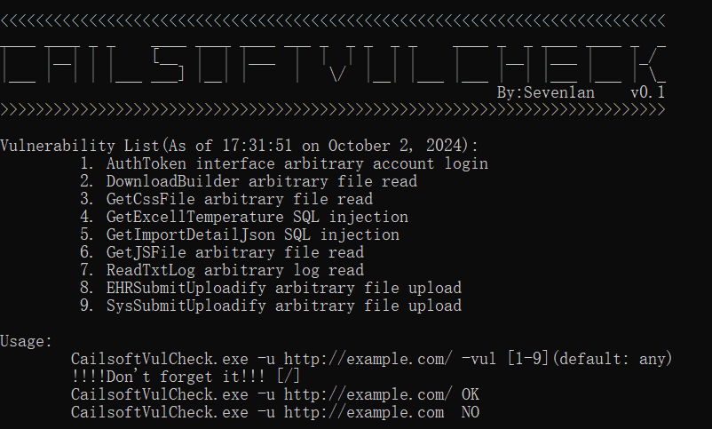
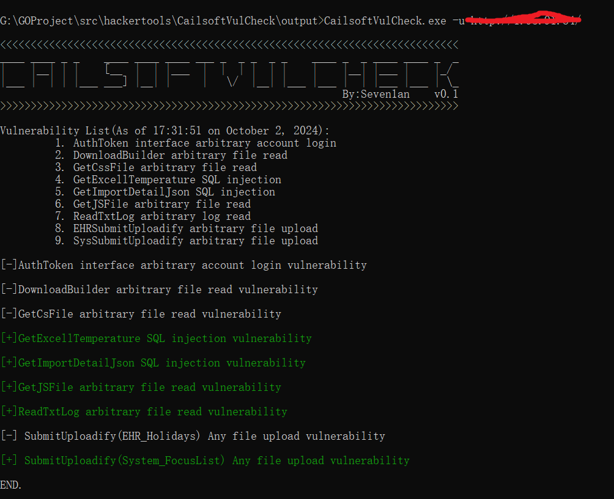
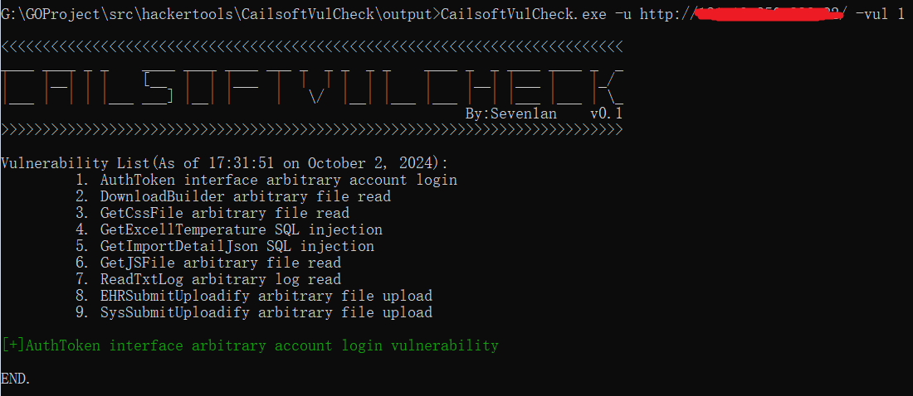

# CailsoftVulCheck


一款基于Go语言编写，针对**赛蓝企业管理系统**的漏洞检测工具


## 声明

**本项目所有内容仅作为安全研究和授权测试使用, 相关人员对因误用和滥用该项目造成的一切损害概不负责**


截止到2024年10月1日，**支持所有已披露漏洞的检测** **9 个** ，后续会随着公开而增加

包括

- AuthToken接口任意账号登录漏洞

- DownloadBuilder任意文件读取漏洞
- GetCssFile存在任意文件读取漏洞
- GetExcellTemperatureSQL注入漏洞
- GetImportDetailJsonSQL注入漏洞
- GetJSFile任意文件读取漏洞
- ReadTxtLog任意文件读取漏洞
- EHR_Holidays/SubmitUploadify任意文件上传漏洞
- System_FocusList/SubmitUploadify任意文件上传漏洞


## 使用

```
CailsoftVulCheck.exe -u http://example.com/ -vul [1-9](default: any)
```

 


存在的漏洞会亮色输出




指定漏洞检测




项目地址:http://github.com/Seven1an/CailsoftVulCheck
